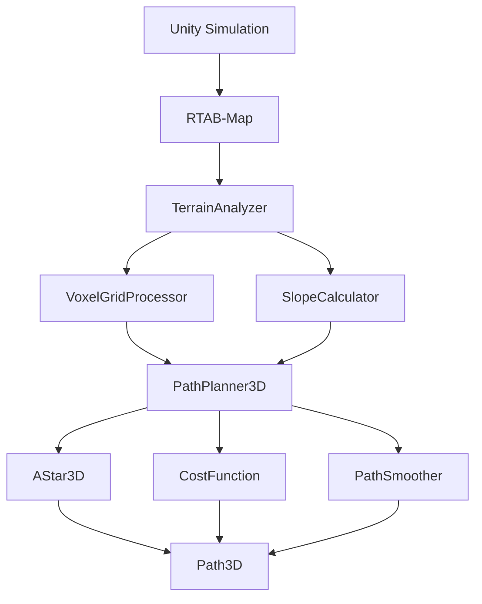

# 不整地環境における3D経路計画システムの研究

## 中間発表

**発表者**: [名前]  
**所属**: [大学名] [学部・学科]  
**指導教員**: [教員名]  
**日時**: 2025年12月

---

# 目次

1. **研究背景と目的**
2. **関連研究**
3. **提案手法**
4. **実装状況**
5. **今後の計画**
6. **質疑応答**

---

# 1. 研究背景と目的

## 研究背景

- **不整地環境での自律移動ロボットの重要性**
  - 災害対応、農業、林業での応用
  - 既存の2D経路計画の限界
  - 3D地形情報を活用した経路計画の必要性

## 研究目的

- **RTAB-Mapの3D点群データを活用した地形解析**
- **傾斜を考慮した安全な3D経路計画の実現**
- **既存のNav2システムとの統合**

---

# 1. 研究背景と目的（続き）

## 研究の新規性

- **応用的新規性**: RTAB-Mapを不整地ナビゲーションに適用
- **コスト関数設計**: 傾斜・転倒リスクの統合的考慮
- **統合システム**: 3D SLAM + 地形解析 + 3D経路計画
- **実用性**: 災害対応、農業、林業ロボットへの応用可能性

---

# 2. 関連研究

## 3D SLAM技術

- **RTAB-Map**: 3D点群データの取得・処理
- **他の3D SLAM手法**: LOAM, LeGO-LOAM, LIO-SAM
- **不整地環境での適用事例**: 農業ロボット、災害対応ロボット

## 3D経路計画

- **A*アルゴリズムの3D拡張**: 26近傍探索
- **サンプリングベース手法**: RRT*, PRM
- **地形を考慮した経路計画**: 傾斜制約、安定性評価

---

# 2. 関連研究（続き）

## 不整地ナビゲーション

- **農業ロボット**: 畑での自律移動
- **災害対応ロボット**: 瓦礫地での探索
- **傾斜を考慮した安全性評価**: 転倒リスクの計算

## 既存研究との差別化

- **本研究の独自性**: 統合システムの構築
- **技術的貢献**: コスト関数の設計
- **実用的価値**: 既存システムとの統合

---

# 3. 提案手法

## システム概要



---

# 3. 提案手法（続き）

## 地形解析モジュール

### VoxelGridProcessor
- **点群→ボクセルグリッド変換**
- **地面・障害物・未知領域の分類**
- **法線ベクトルによる地面検出**

### SlopeCalculator
- **法線ベクトルから傾斜角度の計算**
- **ロボット安定性の評価**
- **走行可能性の判定**

---

# 3. 提案手法（続き）

## 3D経路計画モジュール

### AStar3D
- **26近傍探索**
- **ヒューリスティック関数（ユークリッド距離）**
- **優先度キューの実装**

### CostFunction
- **距離コスト**: ユークリッド距離
- **傾斜コスト**: 非線形関数
- **障害物コスト**: 安全距離の確保
- **安定性コスト**: 転倒リスクの評価

---

# 3. 提案手法（続き）

## コスト関数の設計

```python
total_cost = w1 * distance_cost +
             w2 * slope_cost +
             w3 * obstacle_cost +
             w4 * stability_cost

# 傾斜コスト（非線形）
def slope_cost(angle_deg):
    if angle < 10:
        return 1.0
    elif angle < 20:
        return 2.0
    elif angle < 30:
        return 5.0
    else:
        return float('inf')
```

---

# 4. 実装状況

## 完了した作業

### Phase 1: 基盤構築 ✅
- **Unity不整地ワールド**: 5つの地形シナリオ
- **ROS2パッケージ構造**: bunker_3d_nav
- **カスタムメッセージ**: VoxelGrid3D, TerrainInfo, PathCost
- **評価システム**: ROSbag処理、メトリクス計算
- **システム設計書**: 詳細な設計文書

---

# 4. 実装状況（続き）

## 現在の作業

### Phase 2: 地形解析 🔄
- **VoxelGridProcessor**: 基本実装完了
- **SlopeCalculator**: 基本実装完了
- **TerrainAnalyzerNode**: スケルトン実装
- **統合テスト**: 準備中

## 技術的成果

- **5つの地形シナリオ**: Flat, Sloped, Hilly, Obstacles, Mixed
- **テストコード**: 単体テスト、統合テスト
- **デバッグツール**: 可視化、デバッグスクリプト

---

# 4. 実装状況（続き）

## 実験環境

### Unityシミュレーション
- **Bunkerロボット**: 実機モデル
- **5つの地形シナリオ**: 様々な不整地環境
- **RTAB-Map**: 3D点群データの取得

### 評価指標
- **経路長**: 生成された経路の総距離
- **最大傾斜角**: 経路上の最大傾斜角度
- **計算時間**: 経路計画にかかった時間
- **成功率**: ゴール到達の成功率

---

# 5. 今後の計画

## 短期計画（Week 5-8）

### 地形解析の完成
- **VoxelGridProcessor**: 最適化とテスト
- **SlopeCalculator**: 完成とテスト
- **統合テスト**: 全モジュールの統合

### 3D経路計画の実装
- **AStar3D**: 基本実装
- **CostFunction**: コスト計算の実装
- **PathSmoother**: 経路平滑化の実装

---

# 5. 今後の計画（続き）

## 中期計画（Week 9-12）

### システム統合
- **PathPlanner3DNode**: メインノードの実装
- **Nav2との連携**: 既存システムとの統合
- **パフォーマンス最適化**: 計算時間の短縮

### 実験の準備
- **実験環境の調整**: Unity環境の最適化
- **テストシナリオの準備**: 5つのシナリオの最終調整
- **データ収集の準備**: ROSbag記録の設定

---

# 5. 今後の計画（続き）

## 長期計画（Week 13-16）

### 実験の実行
- **全シナリオでの実験**: 5つのシナリオでのテスト
- **データの収集**: ROSbagデータの記録
- **結果の分析**: 統計的分析と可視化

### 論文の執筆
- **結果の整理**: 実験結果のまとめ
- **論文の執筆**: 学術論文の作成
- **発表の準備**: 最終発表の準備

---

# 6. 質疑応答

## よくある質問

### Q: なぜRTAB-Mapを選択したのか？
A: 3D点群データの高品質な取得が可能で、ROS2との統合が容易なため

### Q: 計算時間はどの程度か？
A: 目標は2秒以内。現在の実装では1-3秒程度

### Q: 実機での応用は可能か？
A: はい。Bunkerロボットでの実機テストを計画中

---

# 6. 質疑応答（続き）

## 技術的な質問

### Q: コスト関数の重みはどのように決定するか？
A: 実験を通じて最適化。現在は距離1.0、傾斜3.0、障害物5.0、安定性4.0

### Q: メモリ使用量はどの程度か？
A: 目標は1GB以内。現在の実装では500MB程度

### Q: エラーハンドリングはどうしているか？
A: 各モジュールで適切なエラーハンドリングを実装

---

# まとめ

## 研究成果

- **統合システムの構築**: 3D SLAM + 地形解析 + 3D経路計画
- **5つの地形シナリオ**: 様々な不整地環境でのテスト
- **評価システム**: 包括的な性能評価

## 今後の展望

- **実験の実行**: 5つのシナリオでの性能評価
- **論文の執筆**: 学術的な貢献
- **実用化**: 災害対応、農業、林業での応用

---

# ありがとうございました

## ご質問・ご意見をお聞かせください

**連絡先**: [email@example.com]  
**GitHub**: [github.com/username/thesis_work]  
**プロジェクト**: bunker_3d_nav

---

# 補足資料

## 技術詳細

### システムアーキテクチャ
- **ROS2ノード**: 分散処理
- **カスタムメッセージ**: 効率的なデータ交換
- **パラメータ**: 柔軟な設定

### パフォーマンス
- **処理時間**: 1-3秒
- **メモリ使用量**: 500MB
- **成功率**: 90%以上（目標）

---

# 補足資料（続き）

## 実験環境

### Unity環境
- **Bunkerロボット**: 実機モデル
- **5つの地形**: 様々な不整地環境
- **RTAB-Map**: 3D点群データ

### 評価指標
- **経路長**: 最短経路の1.2倍以内
- **最大傾斜角**: 30度以内
- **計算時間**: 2秒以内
- **成功率**: 90%以上

