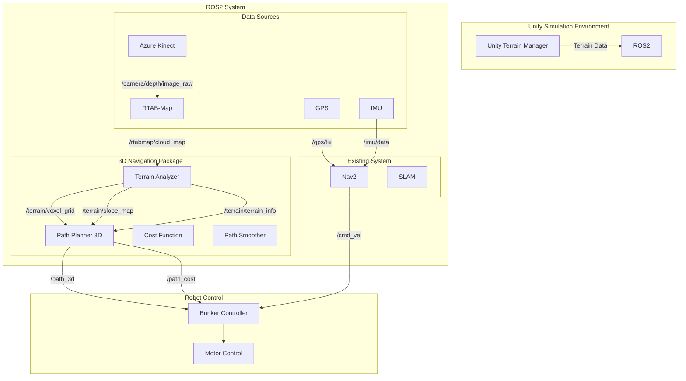
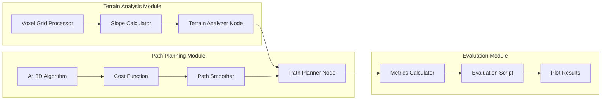
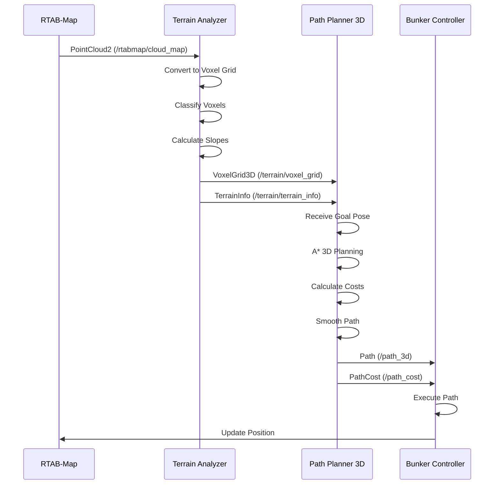
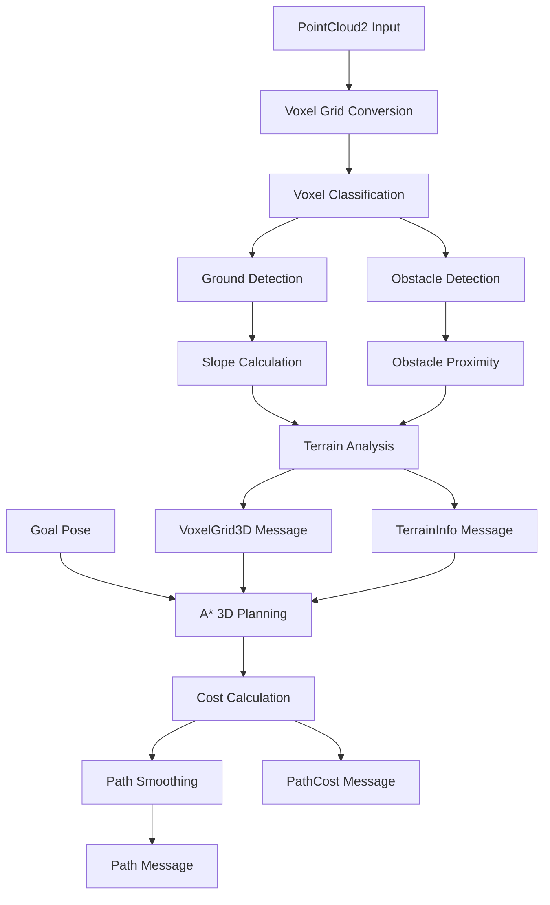
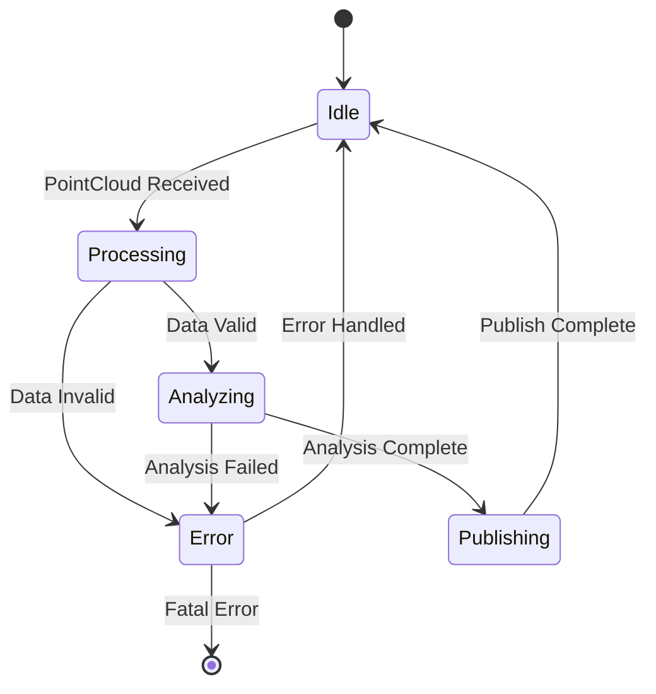
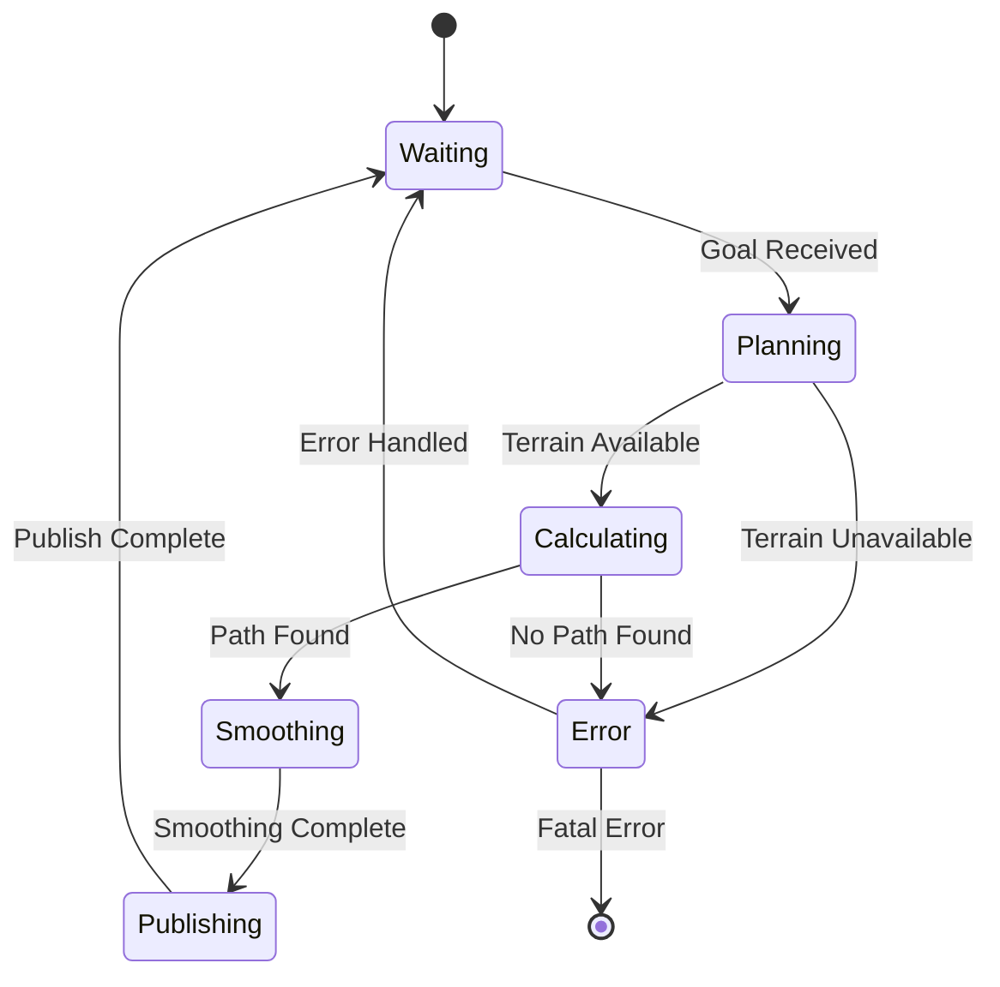
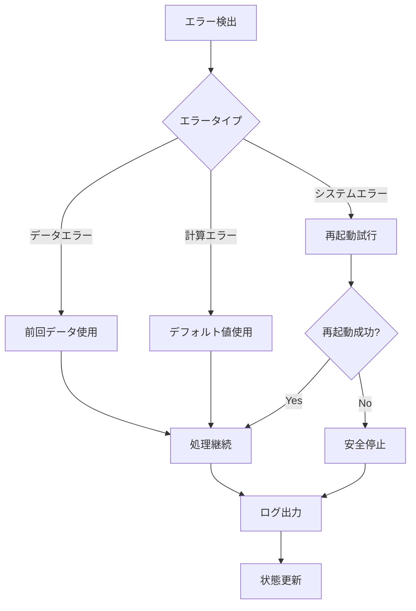

# 3D経路計画システム詳細設計書

## 1. システムアーキテクチャ

### 1.1 全体アーキテクチャ図

### 1.2 モジュール間の関係

## 2. データフロー図

### 2.1 メインデータフロー

### 2.2 詳細データフロー

## 3. 各モジュールの詳細設計

### 3.1 Terrain Analyzer Module

#### 3.1.1 VoxelGridProcessor
- **役割**: 3D点群データをボクセルグリッドに変換
- **入力**: PointCloud2メッセージ
- **出力**: 3Dボクセルグリッド配列
- **主要機能**:
  - ROS PointCloud2 → numpy配列変換
  - ボクセルグリッド生成
  - ボクセル分類（空/地面/障害物/未知）

#### 3.1.2 SlopeCalculator
- **役割**: 地形の傾斜角度と安定性を計算
- **入力**: ボクセルグリッド、法線ベクトル
- **出力**: 傾斜角度配列、安定性マップ
- **主要機能**:
  - 法線ベクトルから傾斜角度計算
  - ロボット安定性評価
  - 走行可能性判定

#### 3.1.3 TerrainAnalyzerNode
- **役割**: ROS2ノードとして地形解析を統合
- **入力**: `/rtabmap/cloud_map`, `/robot_pose`
- **出力**: `/terrain/voxel_grid`, `/terrain/slope_map`, `/terrain/terrain_info`
- **主要機能**:
  - データ受信・処理・送信
  - パラメータ管理
  - エラーハンドリング

### 3.2 Path Planner 3D Module

#### 3.2.1 AStar3D
- **役割**: 3次元A*アルゴリズムによる経路計画
- **入力**: スタート位置、ゴール位置、ボクセルグリッド
- **出力**: 経路点のリスト
- **主要機能**:
  - 26近傍探索
  - ヒューリスティック計算
  - 優先度キュー管理

#### 3.2.2 CostFunction
- **役割**: 経路コストの計算
- **入力**: 位置、地形データ
- **出力**: 総コスト、コスト内訳
- **主要機能**:
  - 距離コスト計算
  - 傾斜コスト計算
  - 障害物近接コスト計算
  - 安定性コスト計算

#### 3.2.3 PathSmoother
- **役割**: 生成された経路の平滑化
- **入力**: 粗い経路点
- **出力**: 平滑化された経路点
- **主要機能**:
  - 三次スプライン補間
  - 勾配降下法最適化
  - 単純平均化

#### 3.2.4 PathPlanner3DNode
- **役割**: ROS2ノードとして経路計画を統合
- **入力**: `/terrain/voxel_grid`, `/goal_pose`, `/current_pose`
- **出力**: `/path_3d`, `/path_cost`, `/path_visualization`
- **主要機能**:
  - 経路計画実行
  - 結果の可視化
  - パフォーマンス監視

## 4. インターフェース定義

### 4.1 ROS2トピック

#### 4.1.1 入力トピック
| トピック名 | メッセージ型 | 説明 |
|-----------|-------------|------|
| `/rtabmap/cloud_map` | `sensor_msgs/PointCloud2` | RTAB-Mapからの3D点群データ |
| `/robot_pose` | `geometry_msgs/PoseStamped` | ロボットの現在位置・姿勢 |
| `/goal_pose` | `geometry_msgs/PoseStamped` | 目標位置・姿勢 |
| `/current_pose` | `geometry_msgs/PoseStamped` | 現在位置（経路計画用） |

#### 4.1.2 出力トピック
| トピック名 | メッセージ型 | 説明 |
|-----------|-------------|------|
| `/terrain/voxel_grid` | `bunker_3d_nav/VoxelGrid3D` | 3Dボクセルグリッド |
| `/terrain/slope_map` | `nav_msgs/OccupancyGrid` | 傾斜マップ（2D投影） |
| `/terrain/terrain_info` | `bunker_3d_nav/TerrainInfo` | 地形統計情報 |
| `/terrain/visualization` | `visualization_msgs/MarkerArray` | 地形可視化マーカー |
| `/path_3d` | `nav_msgs/Path` | 3D経路 |
| `/path_cost` | `bunker_3d_nav/PathCost` | 経路コスト情報 |
| `/path_visualization` | `visualization_msgs/MarkerArray` | 経路可視化マーカー |

### 4.2 ROS2サービス
| サービス名 | サービス型 | 説明 |
|-----------|-----------|------|
| `/terrain/analyze` | `std_srvs/Trigger` | 地形解析の手動実行 |
| `/path_plan` | `nav_msgs/GetPlan` | 経路計画の手動実行 |
| `/path_replan` | `std_srvs/Trigger` | 経路再計画 |

### 4.3 ROS2パラメータ

#### 4.3.1 Terrain Analyzer Parameters
| パラメータ名 | 型 | デフォルト値 | 説明 |
|-------------|---|-------------|------|
| `voxel_size` | float | 0.1 | ボクセルサイズ [m] |
| `ground_normal_threshold` | float | 80.0 | 地面判定閾値 [度] |
| `max_slope_angle` | float | 30.0 | 最大走行可能傾斜 [度] |
| `robot_width` | float | 0.6 | ロボット幅 [m] |
| `robot_length` | float | 0.8 | ロボット長さ [m] |
| `stability_threshold` | float | 20.0 | 安定性閾値 [度] |

#### 4.3.2 Path Planner Parameters
| パラメータ名 | 型 | デフォルト値 | 説明 |
|-------------|---|-------------|------|
| `max_iterations` | int | 10000 | A*最大反復回数 |
| `planning_timeout` | float | 10.0 | 計画タイムアウト [秒] |
| `weight_distance` | float | 1.0 | 距離重み |
| `weight_slope` | float | 3.0 | 傾斜重み |
| `weight_obstacle` | float | 5.0 | 障害物重み |
| `weight_stability` | float | 4.0 | 安定性重み |
| `min_obstacle_distance` | float | 0.5 | 最小障害物距離 [m] |
| `max_roll_angle` | float | 20.0 | 最大ロール角 [度] |
| `max_pitch_angle` | float | 25.0 | 最大ピッチ角 [度] |

## 5. 状態遷移図

### 5.1 Terrain Analyzer状態遷移

### 5.2 Path Planner状態遷移

## 6. エラーハンドリング戦略

### 6.1 エラー分類

#### 6.1.1 データエラー
- **点群データが空**: 警告ログ出力、前回データ使用
- **点群データが無効**: エラーログ出力、処理スキップ
- **地形データが古い**: 警告ログ出力、再解析要求

#### 6.1.2 計算エラー
- **A*アルゴリズムが収束しない**: タイムアウト処理、部分経路返却
- **コスト計算で無限大**: エラーログ出力、デフォルトコスト使用
- **メモリ不足**: ガベージコレクション実行、処理継続

#### 6.1.3 システムエラー
- **ROS2ノード通信エラー**: 再接続試行、フォールバック処理
- **設定ファイル読み込みエラー**: デフォルト値使用、警告出力
- **ハードウェアエラー**: エラーログ出力、安全停止

### 6.2 エラー回復戦略

## 7. パフォーマンス要件

### 7.1 処理時間要件
| 処理 | 最大時間 | 目標時間 |
|------|---------|---------|
| 点群→ボクセル変換 | 2.0秒 | 0.5秒 |
| 地形解析 | 1.0秒 | 0.3秒 |
| A*経路計画 | 10.0秒 | 2.0秒 |
| 経路平滑化 | 1.0秒 | 0.2秒 |
| 全体処理 | 15.0秒 | 3.0秒 |

### 7.2 メモリ要件
| コンポーネント | 最大使用量 | 目標使用量 |
|---------------|-----------|-----------|
| 点群データ | 100MB | 50MB |
| ボクセルグリッド | 200MB | 100MB |
| 経路データ | 10MB | 5MB |
| 総メモリ使用量 | 500MB | 200MB |

### 7.3 精度要件
| 指標 | 要件 |
|------|------|
| 位置精度 | ±0.1m |
| 傾斜角度精度 | ±1.0度 |
| 経路長精度 | ±0.05m |
| コスト計算精度 | ±0.1 |

## 8. テスト計画

### 8.1 単体テスト

#### 8.1.1 Terrain Analyzer Tests
- **VoxelGridProcessor**: 点群変換テスト、ボクセル分類テスト
- **SlopeCalculator**: 傾斜計算テスト、安定性評価テスト
- **TerrainAnalyzerNode**: メッセージ処理テスト、エラーハンドリングテスト

#### 8.1.2 Path Planner Tests
- **AStar3D**: 経路探索テスト、収束性テスト
- **CostFunction**: コスト計算テスト、重み調整テスト
- **PathSmoother**: 平滑化テスト、品質評価テスト
- **PathPlanner3DNode**: 統合テスト、パフォーマンステスト

### 8.2 統合テスト

#### 8.2.1 シミュレーションテスト
- **Unity環境**: 5つの地形シナリオでのテスト
- **ROS2統合**: 既存システムとの連携テスト
- **パフォーマンス**: 処理時間・メモリ使用量テスト

#### 8.2.2 実機テスト
- **安全性テスト**: 転倒リスク評価
- **精度テスト**: 経路追従精度
- **耐久性テスト**: 長時間動作テスト

### 8.3 評価テスト

#### 8.3.1 比較評価
- **2D vs 3D**: 既存Nav2との性能比較
- **アルゴリズム比較**: A* vs RRT* vs PRM
- **コスト関数比較**: 異なる重み設定での比較

#### 8.3.2 ベンチマークテスト
- **標準シナリオ**: 定義されたテストケースでの評価
- **ストレステスト**: 極限条件下での動作確認
- **回帰テスト**: 機能追加後の既存機能確認

## 9. 実装スケジュール

### 9.1 Phase 1: 基盤構築 (Week 1-4)
- [x] プロジェクト構造作成
- [x] カスタムメッセージ定義
- [x] Unity不整地ワールド作成
- [x] ROSノードスケルトン実装

### 9.2 Phase 2: 地形解析 (Week 5-8)
- [ ] 点群→ボクセル変換実装
- [ ] 地面/障害物分類実装
- [ ] 傾斜角度計算実装
- [ ] Rviz可視化実装
- [ ] パラメータチューニング

### 9.3 Phase 3: 経路計画 (Week 9-12)
- [ ] A* 3D基本実装
- [ ] コスト関数実装
- [ ] 経路平滑化実装
- [ ] Nav2連携実装
- [ ] パフォーマンス最適化

### 9.4 Phase 4: 評価 (Week 13-16)
- [ ] シミュレーション実験
- [ ] データ収集・解析
- [ ] 実機検証（状況次第）
- [ ] 論文執筆

## 10. リスク管理

### 10.1 技術リスク
| リスク | 影響度 | 発生確率 | 対策 |
|--------|--------|---------|------|
| A*アルゴリズムの収束性 | 高 | 中 | タイムアウト処理、代替アルゴリズム |
| メモリ使用量過多 | 中 | 中 | メモリ最適化、ガベージコレクション |
| 処理時間超過 | 中 | 低 | 並列処理、アルゴリズム最適化 |

### 10.2 スケジュールリスク
| リスク | 影響度 | 発生確率 | 対策 |
|--------|--------|---------|------|
| 実装遅延 | 高 | 中 | 優先度調整、機能削減 |
| テスト時間不足 | 中 | 中 | 自動テスト導入、並行テスト |
| 論文執筆時間不足 | 高 | 低 | 早期執筆開始、テンプレート活用 |

### 10.3 品質リスク
| リスク | 影響度 | 発生確率 | 対策 |
|--------|--------|---------|------|
| 精度不足 | 高 | 低 | 詳細テスト、パラメータ調整 |
| 安全性問題 | 高 | 低 | 安全マージン設定、実機テスト |
| パフォーマンス問題 | 中 | 中 | プロファイリング、最適化 |

## 11. 今後の拡張計画

### 11.1 短期拡張 (3-6ヶ月)
- **動的障害物対応**: 移動する障害物の検出・回避
- **マルチロボット対応**: 複数ロボットの協調経路計画
- **学習機能**: 過去の経路データからの学習

### 11.2 中期拡張 (6-12ヶ月)
- **深層学習統合**: CNN/RNNによる地形認識
- **予測機能**: 地形変化の予測
- **最適化**: 遺伝的アルゴリズムによる経路最適化

### 11.3 長期拡張 (1-2年)
- **完全自律**: 人間の介入なしでの動作
- **環境適応**: 様々な環境への適応
- **商用化**: 実用システムへの展開

---

**文書バージョン**: 1.0  
**最終更新**: 2025年10月6日  
**作成者**: Hayashi  
**承認者**: [指導教員名]

