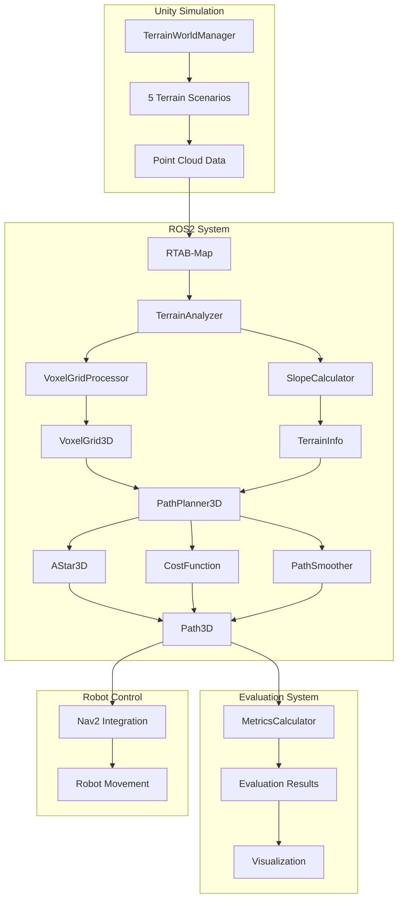
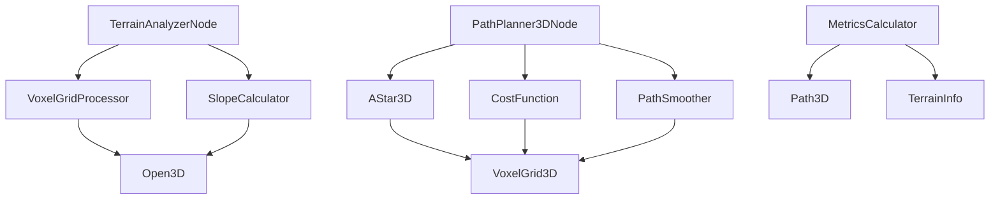

# アーキテクチャドキュメント

## 目次
1. [システム概要](#システム概要)
2. [アーキテクチャ図](#アーキテクチャ図)
3. [モジュール構成](#モジュール構成)
4. [データフロー](#データフロー)
5. [モジュール間の依存関係](#モジュール間の依存関係)
6. [インターフェース仕様](#インターフェース仕様)

## システム概要

### 全体構成
本システムは、不整地環境での3D経路計画を実現するためのROS2ベースのシステムです。RTAB-Mapの3D点群データを活用し、地形の傾斜を考慮した安全な経路計画を行います。

### 主要コンポーネント
1. **Unityシミュレーション環境**: 不整地ワールドの生成
2. **ROS2システム**: ノード間通信とデータ処理
3. **地形解析モジュール**: 点群データの解析
4. **3D経路計画モジュール**: 傾斜を考慮した経路生成
5. **評価システム**: 性能評価とデータ分析

## アーキテクチャ図



## モジュール構成

### 1. 地形解析モジュール (terrain_analyzer)

#### TerrainAnalyzerNode
- **役割**: 地形解析のメインノード
- **入力**: `/rtabmap/cloud_map` (PointCloud2)
- **出力**: 
  - `/terrain/voxel_grid` (VoxelGrid3D)
  - `/terrain/terrain_info` (TerrainInfo)
  - `/terrain/slope_map` (OccupancyGrid)

#### VoxelGridProcessor
- **役割**: 点群データのボクセル化
- **機能**:
  - 点群→ボクセルグリッド変換
  - 地面/障害物分類
  - 法線ベクトル計算

#### SlopeCalculator
- **役割**: 傾斜角度と安定性の計算
- **機能**:
  - 傾斜角度計算
  - 安定性評価
  - 走行可能性判定

### 2. 3D経路計画モジュール (path_planner_3d)

#### PathPlanner3DNode
- **役割**: 3D経路計画のメインノード
- **入力**: 
  - `/terrain/voxel_grid` (VoxelGrid3D)
  - `/goal_pose` (PoseStamped)
- **出力**: 
  - `/path_3d` (Path)
  - `/path_cost` (PathCost)

#### AStar3D
- **役割**: 3次元A*アルゴリズム
- **機能**:
  - 26近傍探索
  - ヒューリスティック計算
  - 経路構築

#### CostFunction
- **役割**: コスト計算
- **機能**:
  - 距離コスト
  - 傾斜コスト
  - 障害物コスト
  - 安定性コスト

#### PathSmoother
- **役割**: 経路平滑化
- **機能**:
  - 三次スプライン補間
  - 勾配降下法
  - 品質評価

### 3. 評価システム (scripts/evaluation)

#### MetricsCalculator
- **役割**: 評価指標の計算
- **機能**:
  - 経路長計算
  - 傾斜角度計算
  - エネルギー効率計算

#### EvaluationScripts
- **役割**: 実験データの処理
- **機能**:
  - ROSbagデータ処理
  - 統計分析
  - 結果可視化

## データフロー

### 1. データ入力フロー
```
Unity → RTAB-Map → PointCloud2 → TerrainAnalyzer
```

### 2. 地形解析フロー
```
PointCloud2 → VoxelGridProcessor → VoxelGrid3D
PointCloud2 → SlopeCalculator → TerrainInfo
```

### 3. 経路計画フロー
```
VoxelGrid3D + TerrainInfo → PathPlanner3D → Path3D
```

### 4. 評価フロー
```
Path3D → MetricsCalculator → Evaluation Results
```

## モジュール間の依存関係

### 依存関係図


### 依存関係の詳細

#### 直接依存
- **TerrainAnalyzerNode** → **VoxelGridProcessor**, **SlopeCalculator**
- **PathPlanner3DNode** → **AStar3D**, **CostFunction**, **PathSmoother**
- **AStar3D** → **CostFunction**
- **PathSmoother** → **AStar3D**

#### 間接依存
- **PathPlanner3DNode** → **VoxelGridProcessor** (via VoxelGrid3D)
- **PathPlanner3DNode** → **SlopeCalculator** (via TerrainInfo)
- **MetricsCalculator** → **TerrainAnalyzerNode** (via TerrainInfo)

## インターフェース仕様

### 1. ROS2トピック

#### 入力トピック
| トピック名 | メッセージ型 | 説明 |
|-----------|-------------|------|
| `/rtabmap/cloud_map` | PointCloud2 | 3D点群データ |
| `/goal_pose` | PoseStamped | 目標位置 |
| `/robot_pose` | PoseStamped | ロボット位置 |

#### 出力トピック
| トピック名 | メッセージ型 | 説明 |
|-----------|-------------|------|
| `/terrain/voxel_grid` | VoxelGrid3D | ボクセルグリッド |
| `/terrain/terrain_info` | TerrainInfo | 地形情報 |
| `/terrain/slope_map` | OccupancyGrid | 傾斜マップ |
| `/path_3d` | Path | 3D経路 |
| `/path_cost` | PathCost | 経路コスト |

### 2. カスタムメッセージ

#### VoxelGrid3D.msg
```msg
std_msgs/Header header
float32 resolution
geometry_msgs/Point origin
int32 size_x
int32 size_y
int32 size_z
uint8[] data
float32[] slopes
```

#### TerrainInfo.msg
```msg
std_msgs/Header header
float32 avg_slope
float32 max_slope
float32 traversable_ratio
int32 total_voxels
int32 ground_voxels
int32 obstacle_voxels
```

#### PathCost.msg
```msg
std_msgs/Header header
float32 total_cost
float32 distance_cost
float32 slope_cost
float32 obstacle_cost
float32 stability_cost
float32 path_length
float32 max_slope
float32 avg_slope
```

### 3. パラメータ

#### 地形解析パラメータ
| パラメータ名 | 型 | デフォルト値 | 説明 |
|-------------|---|-------------|------|
| `voxel_size` | float | 0.1 | ボクセルサイズ [m] |
| `ground_normal_threshold` | float | 80.0 | 地面判定の法線角度 [度] |
| `max_slope_angle` | float | 30.0 | 最大傾斜角度 [度] |
| `stability_threshold` | float | 20.0 | 安定性閾値 [度] |

#### 経路計画パラメータ
| パラメータ名 | 型 | デフォルト値 | 説明 |
|-------------|---|-------------|------|
| `max_iterations` | int | 10000 | 最大反復回数 |
| `distance_weight` | float | 1.0 | 距離重み |
| `slope_weight` | float | 3.0 | 傾斜重み |
| `obstacle_weight` | float | 5.0 | 障害物重み |
| `stability_weight` | float | 4.0 | 安定性重み |

### 4. サービス

#### 地形解析サービス
| サービス名 | サービス型 | 説明 |
|-----------|-----------|------|
| `/terrain/analyze` | AnalyzeTerrain | 地形解析の実行 |
| `/terrain/get_info` | GetTerrainInfo | 地形情報の取得 |

#### 経路計画サービス
| サービス名 | サービス型 | 説明 |
|-----------|-----------|------|
| `/path_3d/plan` | PlanPath3D | 3D経路計画の実行 |
| `/path_3d/smooth` | SmoothPath | 経路平滑化の実行 |

## パフォーマンス要件

### 1. 処理時間
- **地形解析**: < 1秒
- **経路計画**: < 2秒
- **全体システム**: < 3秒

### 2. メモリ使用量
- **地形解析**: < 500MB
- **経路計画**: < 200MB
- **全体システム**: < 1GB

### 3. 精度
- **ボクセル分類精度**: > 95%
- **傾斜計算精度**: ±2度
- **経路計画成功率**: > 90%

## セキュリティ考慮事項

### 1. データ保護
- センサーデータの暗号化
- 通信の認証
- アクセス制御

### 2. システム保護
- 入力検証
- エラーハンドリング
- リソース制限

## 拡張性考慮事項

### 1. モジュール追加
- 新しい地形解析手法
- 新しい経路計画アルゴリズム
- 新しい評価指標

### 2. プラットフォーム対応
- 異なるロボットプラットフォーム
- 異なるセンサー
- 異なる環境

### 3. 機能拡張
- リアルタイム処理
- マルチロボット対応
- 学習機能
