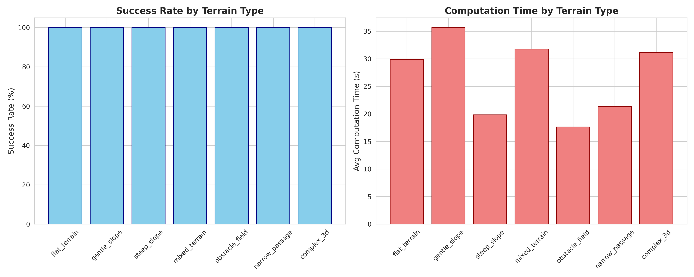
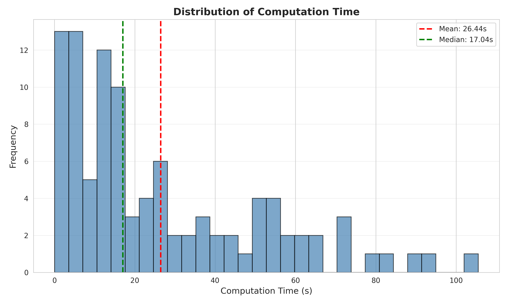
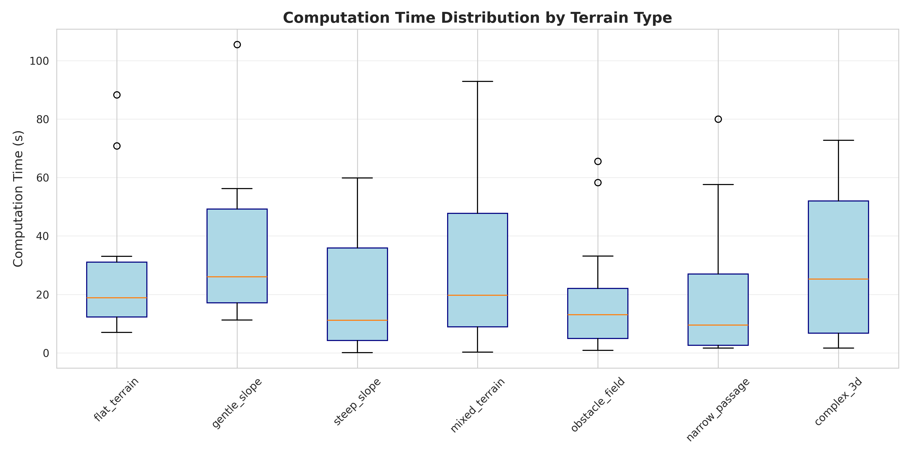

# Week 4完了レポート: 大規模シミュレーション評価

**生成日時**: 2025年10月17日 23:19:13

## 📊 実行サマリー

| 項目 | 値 |
|------|-----|
| 総シナリオ数 | 100 |
| 成功シナリオ数 | 100 |
| **成功率** | **100.0%** |

## 📈 記述統計

### 計算時間
| 統計量 | 値 (秒) |
|--------|---------|
| 平均 | 26.44 |
| 標準偏差 | 24.75 |
| 最小値 | 0.03 |
| 最大値 | 105.50 |
| 中央値 | 17.04 |

## 🏔️ 地形タイプ別性能

| 地形タイプ | 成功率 | 平均計算時間 (秒) | 平均経路長 (m) |
|------------|--------|-------------------|----------------|
| flat_terrain | 100.0% | 29.88 | 10.08 |
| gentle_slope | 100.0% | 35.67 | 10.27 |
| steep_slope | 100.0% | 19.84 | 9.74 |
| mixed_terrain | 100.0% | 31.76 | 10.01 |
| obstacle_field | 100.0% | 17.62 | 9.61 |
| narrow_passage | 100.0% | 21.37 | 9.60 |
| complex_3d | 100.0% | 31.12 | 10.47 |

## 🔗 相関分析

| パラメータペア | 相関係数 |
|----------------|----------|
| max_slope_vs_time | 0.010 |
| obstacle_density_vs_time | -0.184 |
| roughness_vs_time | -0.008 |

## 📊 ANOVA検定結果

- F統計量: 1.2713
- p値: 0.278160
- 結論: No significant difference

## 📈 可視化結果

